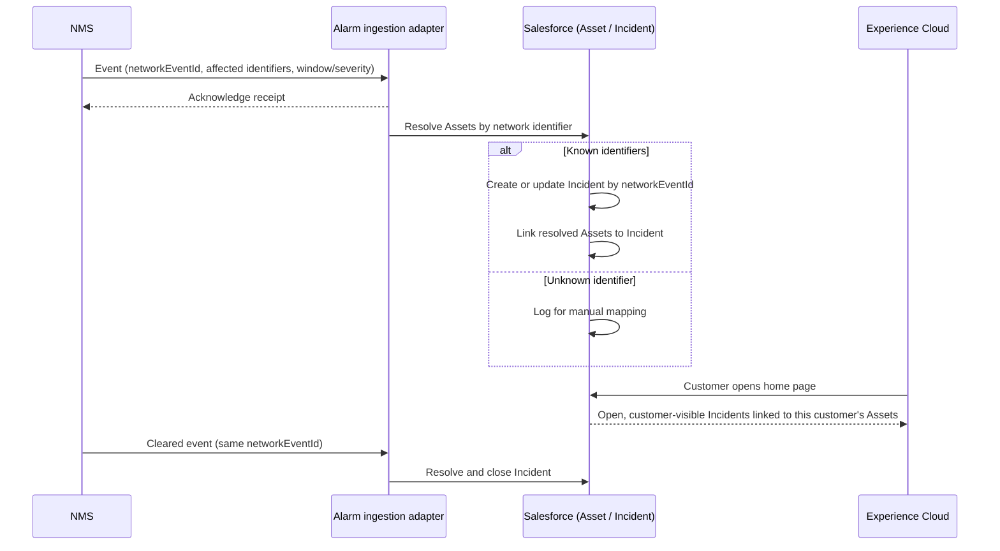

# NMS alarm/event ingestion — sequence

The diagram describes the proposed contract and system responsibilities.

## Interpretation
The NMS never learns which customers are affected; Salesforce performs that correlation privately. The portal never queries the NMS or the adapter directly — it only reads Incident and Asset state already resolved in Salesforce.
