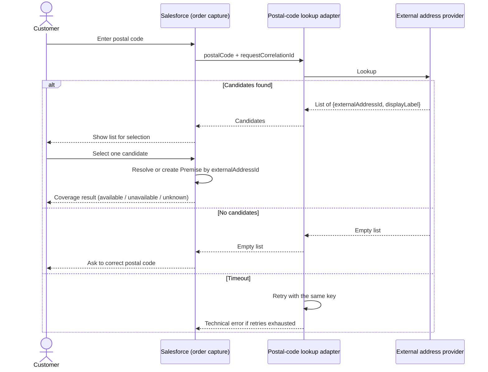

# Postal code to address candidates — sequence

The diagram describes the proposed contract and system responsibilities.

## Interpretation
The external provider never sees which candidate the customer picked, only the postal code query. The coverage decision itself never leaves Salesforce.
