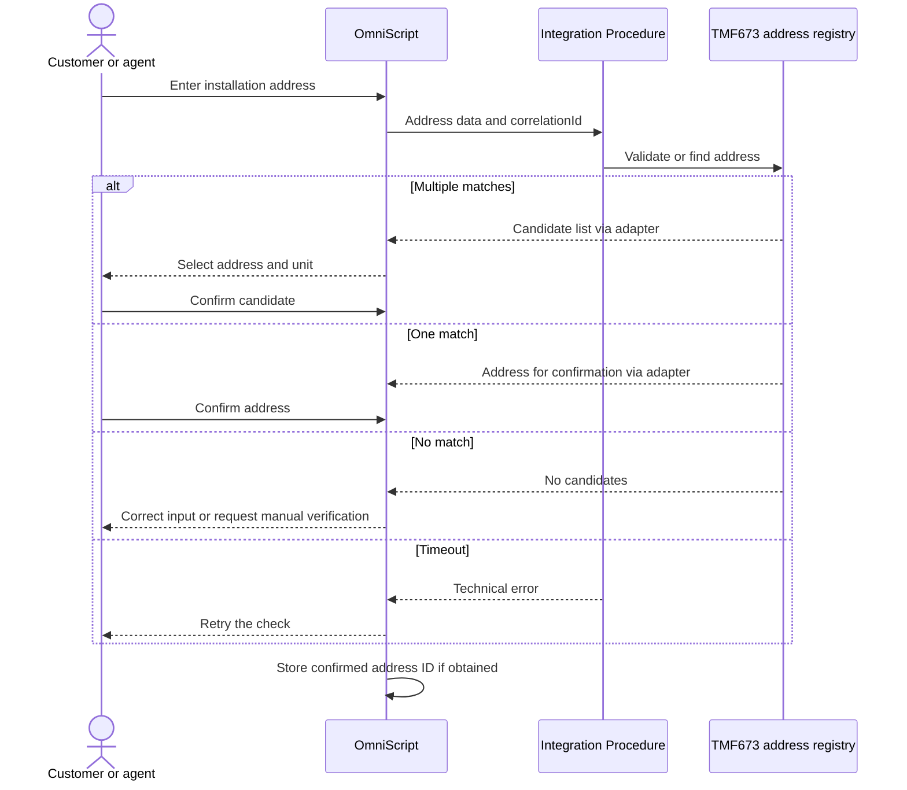

# Address validation — sequence

The diagram describes the proposed contract and system responsibilities.

## Interpretation
Error paths remain visible to the agent. Durable business state does not depend on a single HTTP call succeeding.
